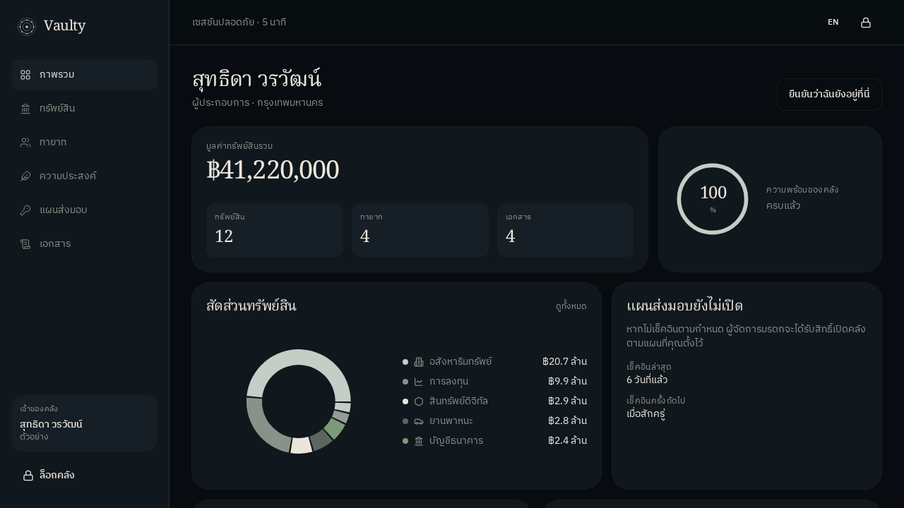

# Vaulty

คลังมรดกดิจิทัลส่วนตัว — รหัสผ่าน ทรัพย์สิน จดหมายถึงทายาท และชุดเอกสารสำหรับครอบครัว / ผู้จัดการมรดก

**รหัสคลังไม่ขึ้นเซิร์ฟเวอร์** เข้ารหัสบนเครื่องด้วย PBKDF2-HMAC-SHA256 แล้วเก็บเป็นไฟล์ที่คุณถือเอง

> ไฟล์จาก Vaulty **ไม่ใช่พินัยกรรม** ไม่ใช่คำสั่งศาล และไม่โอนทรัพย์ให้ใคร ข้อความในแอปไม่ใช่คำปรึกษาทางกฎหมาย

A private digital legacy vault. The vault code never leaves the device. Files you export are not a legal will.



## สิ่งที่ทำได้

- สร้างคลัง ล็อกด้วย PIN หรือประโยคผ่าน กู้จากไฟล์ `vaulty-sealed.json` บนเครื่องใหม่
- ทรัพย์สิน ทายาท จดหมาย เอกสาร — ส่งชุดครอบครัว (ตัดรหัส) หรือชุดผู้จัดการมรดก (มีรหัส)
- ชุดทนาย: สินสมรส ประมาณการภาษีการรับมรดกไทย ที่เก็บต้นฉบับพินัยกรรม
- สำรองเข้ารหัสบนคลาวด์และสวิตช์คนตาย (ต้องมีบัญชี) — เนื้อหาคลังยังเป็น ciphertext
- ไทย / อังกฤษ · ความยินยอมตาม พ.ร.บ. คุ้มครองข้อมูลส่วนบุคคล

## สิ่งที่ยังไม่ทำ

| เรื่อง | สถานะ |
| --- | --- |
| จดนิติบุคคล | ยังไม่จด — นโยบายและความเป็นส่วนตัวเป็นฉบับเตรียมขาย |
| เก็บเงินจริง | โหมดทดสอบ ไม่ตัดบัตร ไม่โอนเงิน |
| เมล / ไลน์ เมื่อเลยกำหนด | ต้องต่อ Resend และ webhook ตอนขึ้นโฮสต์จริง |
| พินัยกรรมที่ทนายเซ็นแล้วมีผล | แอปช่วยจัดเอกสาร ไม่ทำแทนแบบที่ ป.พ.พ. กำหนด |

แพ็กเกจทดสอบ (ยังไม่เก็บเงิน): **ครอบครัว** ฿1,990 · **มรดก** ฿4,990 · **สำนักงาน** ฿14,900 ต่อปี รวม VAT 7%

## ใช้กับครอบครัว (ไม่ต้องมีเซิร์ฟเวอร์)

1. สร้างคลัง ตั้งรหัสที่จำได้ — ประโยคผ่านดีกว่า PIN ถ้าไม่ยอมจำตัวเลข
2. กรอกทรัพย์ ทายาท ผู้จัดการมรดก
3. ส่งออกไฟล์สำรองเข้ารหัส เก็บคนละที่กับรหัส
4. ส่งชุดครอบครัวให้ทายาท (ไม่มีรหัสs) และชุดผู้จัดการมรดกให้คนที่ควรปลดล็อกได้
5. ทดลองกู้ไฟล์บนเครื่องเปล่า ก่อนของจริงจะถึงมือคนอื่น

ลืมรหัสs = คลังบนเครื่องนั้นเปิดไม่ได้ สำรองไฟล์ไว้ก่อน

## ความปลอดภัย

- Zero-knowledge: เซิร์ฟเวอร์เก็บได้แค่ blob เข้ารหัสs ไม่มีรหัสคลัง
- ล็อกเมื่อใส่รหัสsผิดซ้ำ
- CSP เข้ม, กัน SSRF บน webhook, เลขที่ใบเสร็จออกแบบอะตอมมิกไม่ชนกัน
- สิทธิถอนความยินยอม / ลบข้อมูลบนเซิร์ฟเวอร์ได้จากแผนส่งมอบ

## รันโปรเจก

```bash
npm install
npm run dev
```

เปิดที่พอร์ตที่สคริปต์ `dev` ระบุใน `package.json`

```bash
npm test
npx tsc --noEmit
```

ฐานข้อมูลฝังตัว (PGLite) ใช้ตอนพัฒนา — รีสตารท์แล้วข้อมูลบัญชีบนเซิร์ฟเวอร์หาย ของในคลังอยู่ที่เบราว์เซอร์และไฟล์ที่ส่งออก  
ขึ้นจริงตั้ง `DATABASE_URL` (Postgres) และถ้าจะยิงสวิตช์คนตายตั้ง `CRON_SECRET` · เมลจริงใช้ `RESEND_API_KEY`

## สแต็ก

React · TanStack Start · Zustand · Web Crypto · Better Auth · Postgres / PGLite

---

Vaulty ยังไม่จดทะเบียนนิติบุคคล ใช้เป็นเครื่องมือส่วนตัวได้ ยังไม่เปิดรับเงินจากสาธารณะ
